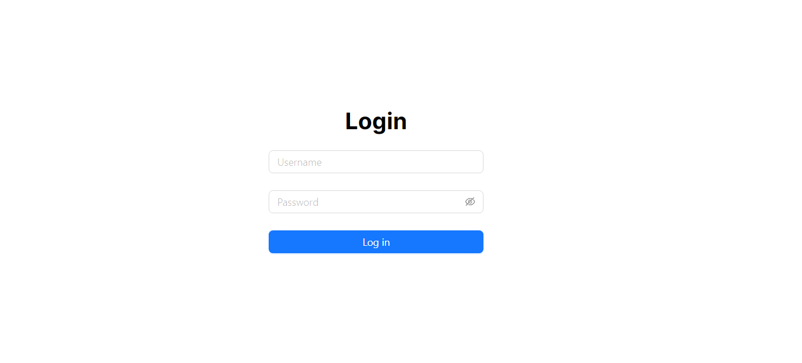

# SkinX Assignment: Software Engineer (Fullstack)

## Installation

```bash
$ npm install
```

## Running the app

```bash
$ npm run dev
```

Open [http://localhost:3000](http://localhost:3000) with your browser to see the result.

## Login



- Username: admin
- Password: p@ssw0rd

## เมื่อ login เสร็จจะเข้ามาที่หน้าหลัก


- กรอบสี<span style="color:red">แดง</span>สามารถค้นหาตาม title, tags ได้โดยการกดปุ่ม search
- กรอบสี<span style="color:#1677FF">น้ำเงิน</span>จะแสดง content ตาม tag เมื่อกดที่ปุ่ม
- กรอบสี<span style="color:green">เขียว</span>จะแสดง pagination

